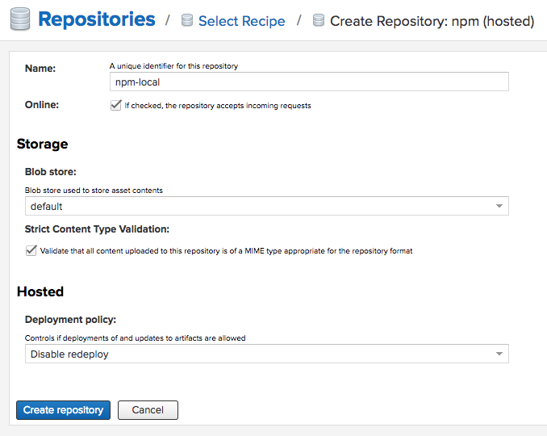

# Private NPM Registry for Development

Setup your own private NPM registry on your local machine.

### Nexus 3 Repository Manager

The [Nexus repository manager](https://hub.docker.com/r/sonatype/nexus3/) is available for free. So we'll use that.

## Setup

### 1) Start Nexus in Docker

Inside this project folder, just run:

```
docker-compose up --build
```

Then open [http://localhost:8081](http://localhost:8081) and Nexus is running.

### 2) Login

There's no customization of the image so the default credentials apply:

- username: `admin`
- password: `admin123`

You can change them once you login if you want.

### 3) Add a new NPM Registry

Once logged in as administration, you can **add a _hosted_ npm repository**. This is where we will be publishing our private modules.



In the screenshot, I named my repository `npm-local` so my npm registry URL is `http://localhost:8081/repository/npm-local`.

## Publishing a Private Module

To keep my `package.json` clean, I set the registry using the `NPM_CONFIG_REGISTRY` environment variable.

To publish, you will need to authenticate as well, which is why I use a `local_publish.sh` file:

```bash
NPM_CONFIG_REGISTRY=http://localhost:8081/repository/npm-local/ \
NPM_CONFIG_EMAIL=you@example.com \
NPM_CONFIG_ALWAYS_AUTH=true \
NPM_CONFIG__AUTH=YWRtaW46YWRtaW4xMjM= \
	npm publish
```

The authentication token is for the default `admin` user with the `admin123` password. Because this is just for local development, there is no need to change it.

#### Changed Password?

If you changed the admin password, you will need to generate the proper auth token like so:

```bash
$ echo -n 'admin:<PASSWORD>' | openssl base64
```


## Installing a Private Module

Your module probably has dependencies, which means to use the local registry, you also need access to those packages. So you need to:

1. Add a new _proxy_ registry named `npm-official` to proxy the official npm registry at https://registry.npmjs.org.

2. Add a new _group_ registry named `npm-all` that combines both `npm-local` and `npm-official`.

So in the end you have 3 registries:

| Registry Type | Description | URL |
|:--|:--|:--|
| group | install from | http://localhost:8081/repository/npm-all/ |
| proxy | mirror | http://localhost:8081/repository/npm-official/ |
| hosted | publish to | http://localhost:8081/repository/npm-local/ |

So finally, to install all modules including private ones, run:

```bash
$ NPM_CONFIG_REGISTRY=http://localhost:8081/repository/npm-all/ npm install
```

### Caveat: `package-lock.json`

If you have a previously generated `package-lock.json` file, npm may complain. And it will change all the URLs if you install from this directory.

As I use this just for testing private modules, I install my packages and then reset my lock file in git, whatever works 🤷‍♀️.

## Use Cases

There's nothing fancy here. Why would you set this up?

- You are working on a Node.js module and want to test across code bases without publishing your module and without the additional complexity of git submodules.
- You work for a large corporation and have no access to internal infrastructure when working remotely (🙋).

## References

- [Nexus documentation: Node Packaged Modules and npm Registries](https://help.sonatype.com/repomanager3/node-packaged-modules-and-npm-registries)
- [npmjs.com: npm publish](https://docs.npmjs.com/cli/publish)
- [npmjs.com: configuring npm with environment variables](https://docs.npmjs.com/misc/config#environment-variables)
- [Semantic Versioning Spec - prelease versions](https://semver.org/#spec-item-9)
- [Sonatype: Nexus OSS vs Pro](https://www.sonatype.com/nexus-repository-oss-vs.-pro-features)
- [Nexus image on Docker Hub](https://hub.docker.com/r/sonatype/nexus3/)
- [Nexus image on GitHub](https://github.com/sonatype/docker-nexus3)
